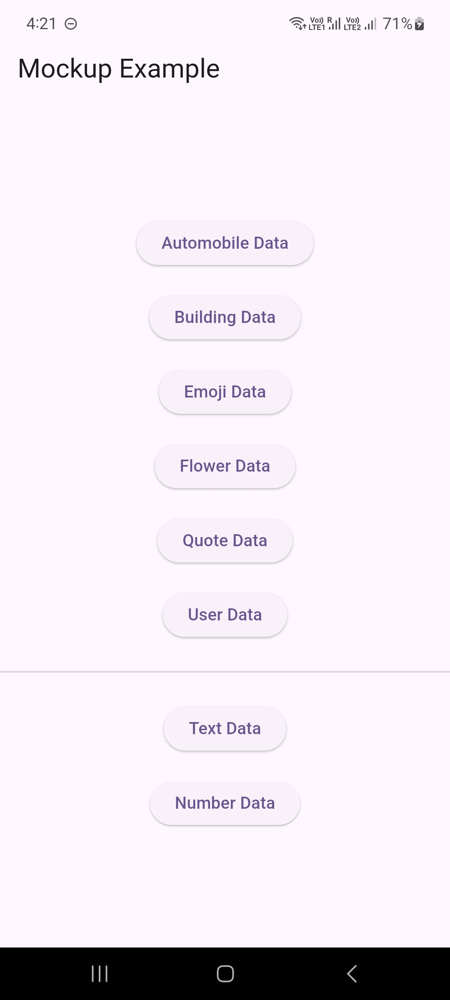
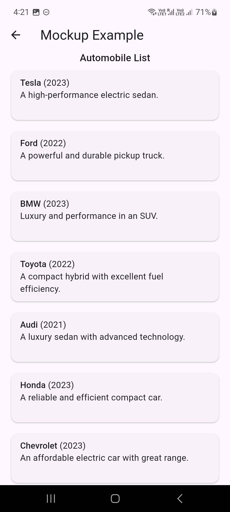
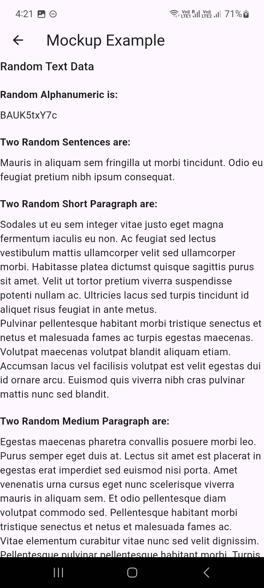
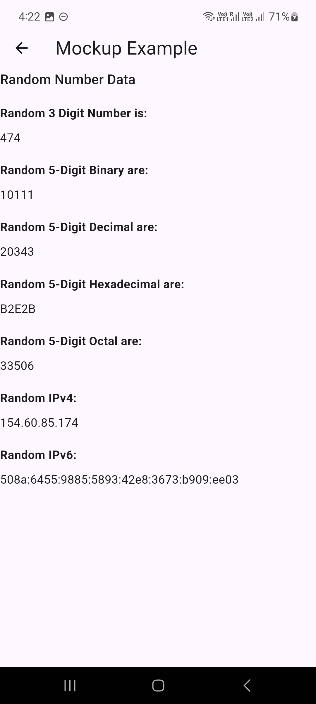

# 📦 Mockup

Mockup helps developers quickly generate and use predefined mock data for various categories like automobiles, buildings, emojis, and more. It’s designed to boost your development speed, especially when you're working on UI, testing, or prototyping without an actual backend.

### 🚀 Why Use Mockup?

- ✅ Ready-to-use Models – Includes a wide range of predefined POJOs to get you started instantly.
- 🔌 Bridge the API Gap – Perfect for filling in while your backend is under development.
- 🧪 Fast Prototyping – Showcase your UI and features without waiting for real data.
- ⚡ Boost Productivity – Focus more on building features, not faking data every time.
- 🎯 Developer-Friendly – Simple to integrate and easy to extend.

## 🚀 Installation

Add mockup to your project by including it in your pubspec.yaml file:

```yaml
dependencies:
  mockup: ^1.0.0
```

Or use the command line for quick setup:

```bash
flutter pub add mockup
```

## Usage

The `mockup` package provides an easy way to fetch predefined data for multiple categories such as automobiles, buildings, emojis, flowers, quotes, and users.

### 🔧 Example

```dart
// Automobiles
List<AutomobileModel> cars = Mockup.automobile.getAll();
AutomobileModel randomCar = Mockup.automobile.getRandomItem();

// Buildings
List<BuildingModel> buildings = Mockup.building.getItems(10);
BuildingModel buildingAtIndex = Mockup.building.getItemAt(2);

// Emojis
List<EmojiModel> emojis = Mockup.emoji.getShuffledList();
EmojiModel randomEmoji = Mockup.emoji.getRandomItem();

// Flowers
List<FlowerModel> flowers = Mockup.flower.getAll();

// Quotes
QuoteModel quoteOfTheDay = Mockup.quote.getRandomItem();

// Users
List<UserModel> users = Mockup.user.getItems(5);
```

### 📚 Method Descriptions

Each category (like Mockup.automobile, Mockup.building, etc.) includes the following methods:

- `getAll()`
Returns all available data items as a distinct list.

- `getItems([int total = 1])`
Returns a list with the specified number of items. If the total exceeds available unique items, duplicates may be included.

- `getShuffledList()`
Returns a shuffled copy of all data items. The original list remains unchanged.

- `getItemAt(int index)`
Returns the item at the specified index. Index wraps around if it's out of bounds.

- `getRandomItem()`
Returns a single, randomly selected item.


### ✍️ Text Generation

`Mockup.text` provides utilities to generate random alphanumeric strings, sentences, and paragraphs—perfect for filling in placeholder content during UI development or testing.

### 🔧 Example

```dart
// Generate a random alphanumeric string (10 characters)
final randomAlphanumeric = Mockup.text.randomAlphanumeric;

// Generate 2 random sentences
final twoSentences = Mockup.text.generateSentences(numberOfSentence: 2);

// Generate 2 short paragraphs
final twoShortParas = Mockup.text.generateShortParagraph(2);

// Generate 2 medium paragraphs
final twoMediumParas = Mockup.text.generateMediumParagraph(2);

// Generate 2 long paragraphs
final twoLongParas = Mockup.text.generateLongParagraph(2);
```

### 📚 Method Descriptions

- `randomAlphanumeric`
Returns a 10-character random alphanumeric string.

- `generateSentences({int numberOfSentence = 1})`
Generates the specified number of random, grammatically structured sentences.

- `generateShortParagraph([int numberOfParagraph = 1])`
Returns one or more short paragraphs containing a few sentences each.

- `generateMediumParagraph([int numberOfParagraph = 1])`
Returns medium-sized paragraphs with a moderate number of sentences.

- `generateLongParagraph([int numberOfParagraph = 1])`
Returns long paragraphs composed of a larger number of sentences.

### 🔢 Number Generation

`Mockup.number` provides utilities for generating random numeric values and formatted strings in various number systems—decimal, binary, hexadecimal, octal—as well as random IP addresses. It’s great for testing inputs, generating placeholder data, or simulating system-level values.

### 🔧 Example

```dart
// Generate a random number between 100 and 999
final random3DigitNumber = Mockup.number.randomDigit(100, 999);

// Generate a 5-digit binary string
final random5DigitBinary = Mockup.number.randomBinaryString(5);

// Generate a 5-digit decimal string
final random5DigitDecimal = Mockup.number.randomDecimalString(5);

// Generate a 5-digit hexadecimal string
final random5DigitHexadecimal = Mockup.number.randomHexString(5);

// Generate a 5-digit octal string
final random5DigitOctal = Mockup.number.randomOctalString(5);

// Generate a random IPv4 address
final randomIPv4 = Mockup.number.randomIPv4();

// Generate a random IPv6 address
final randomIPv6 = Mockup.number.randomIPv6();
```

### 📚 Method Descriptions

- `randomDigit([int from = 0, int to = 99])`
Returns a random integer between the specified bounds.

- `randomDecimalString([int length = 1])`
Generates a string of decimal digits (0–9) of the given length.

- `randomBinaryString([int length = 1])`
Generates a binary string (e.g., "01011") of the given length.

- `randomHexString([int length = 1])`
Produces a hexadecimal string (0–F) of the specified length.

- `randomOctalString([int length = 1])`
Generates an octal string (0–7) of the desired length.

- `randomIPv4()`
Generates a random IPv4 address in the format x.x.x.x.

- `randomIPv6()`
Produces a random IPv6 address with eight 4-digit hex segments.

## Gallery







## Contributing
Pull requests are welcome. For major changes, please open an issue first to discuss what you would like to change.


## License
[MIT](https://choosealicense.com/licenses/mit/)